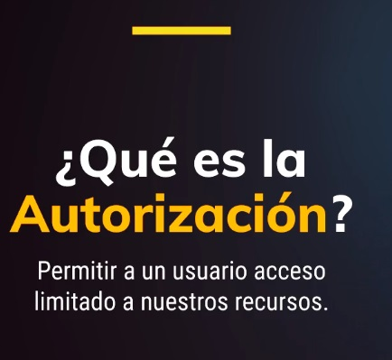

# Autentificación con Passport.js - Platzi
## Stacks de seguridad

### Intranet
Antiguamente las empresas se comunicaban mediante una intranet que a diferencia del internet esta es una red privada que funciona dentro de las compañias en esta red habian protocolas como **SOAP** **SAML** y **WS FEDERATION**, pero estos protocolos se quedaron muy cortos con la revolución mobile, ademas tecnologías como HTML5 empezaron a necesitar otra serie de cosas y conceptos como la __autentificación__ y la __autorización__ tambien necesitaban una evolución, ademas el auge de los __microservicios__ y la necesidad de tener mutiples clientes hicierón necesario la creación de un nuevo stack

### Stack de seguridad moderna
Este stack se compone generalmente de 3 protocolos

#### Json Web Token
Es un standard de código abierto que nos permite comunicarnos entre 2 clientes de una manera mucho más segura 
#### Open Authorization 2.0
Es un standard de la industria que nos permite implementar autorización(tener en cuenta las diferencias con autentificación)
Llego a una versión 2 por la necesidad de adaptarse a las nuevas tecnologias mobile
#### OpenID Connect
Es una capa de autentificación que funciona por encima de OAuth 2.0
## Autenticación

Acción de verificar la identidad de un usuario, verificar si el usuario existe y que sea el.
Algunas casas tienen un visor o camaras pero con la misma intencion, saber la identidad del que toca nuestras puertas de esa manera podemos decidir si lo dejamos entrar o no.

**¿Por qué hacemos esto?**
Porque en nuestras casas tenemos cosas personales y nosotros no queremos que todo el mundo vea nuestas cosas personales y en los sistemas pasa algo similiar, pero en vez de usar camaras usas el __usuario__ y __contraseña__ aunque algunos sistemas usan autentificación passwordless como huellas digitales u otros sistemas que no implica introducir la contraseña.

En nuestra aplicación vamos a implementar autenticación para posteriormente generar un Token de autorizacón

## Autorización

Los carros modernos suelen tener 2 llaves una llave que sibe para conducir y otra para el valet parking, este es un servicio que tienen algunos restaurantes o centros comericales donde un personal lo aparka por ti, esta llave tiene permisos muy limitados como solo para arrancar el carro mas no para abrir el baúl

En los sistemas pasas algo muy similiar, donde nostros otorgamos permisos de solo lectura y escritura en nuestra aplicación nostros vamos a otorgar una serie de permisos que van al usuario final de solo lectura y escritura sobre ciertas colecciones pero tambien vamos a otorgar ciertos permisos administrativos y rsto lo vamos a hacer manejando unos tokens que vamos a otorgarle a nuestro servidor.

## Sesiones

Cuando visitamos un sitio web se crea una petición HTTP, un protocolo que no tiene estado eso quiere decir que muchas peticiones HTTP nunca comparten información entre si, asi que la manera de compartir información de peticiones HTTP es mediante una sesión.

Cuando visitas un sitio por primera vez se crea una sesión no es necesario que estes autentificado para que esta sesión sea creada.

Supongamos que vas a un sitio a buscar vuelos, cuando tu entras al sitio se te crea una sesión y a medidas que vas haciendo busquedas de vuelo se van guardando tus preferencias de busqueda en esta sesión luega esta sesión genera un ID que es guardada en una cookie, la cookie es un archivo que se almacena en tu navegador para que cuando cierres el navegador la cookie permanezca con el ID de la sesión asi al proxima vez que vuelvas ese ID de la sesión que permanece en la cookie se relaciona con la sesión que estaba previamente abierta y asi puede cargar tus preferencias en los vuelos que estabas buscando, es por eso que muchas veces cuando nostros no iniciamos sesión podemos ver que nuestras preferencias estan ahi.

 Cuando hay un proceso de autenticación la sesión se almacena y se relaciona directamente con tu usuario por seguridad la sesión deberia terminar ciertos minutos despues de que halla inactividad, sinembargo dependiendo el mecanismo que estes usando prodias tener sesiones abiertas por dias incluso por meses

 __Cookies session__ y __Express Session__  Son librerias que nos permite implementar todo el tema de sesiones en express la diferencias mpas grande es que cookies session nos permite guardar la session en la cookie y express session nos permite guardar sesión en memoria en el lado del servidor, a la hora de escalar la sesion es muy importante usar base de datos en memoria como redis, eso es una ventaja que tiene JWT ya que no tiene estado y no necesita memoria 

 ## Resumen modulo 1
 

